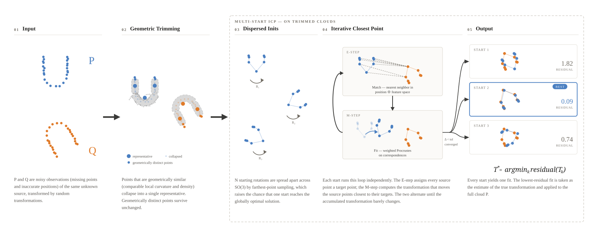

# Transformation Recovery

Recovering the rigid (and elastic) transformation between two unordered, noisy point clouds that both originate from a shared but unknown source cloud.

<video src="https://github.com/user-attachments/assets/85f458bf-f2f5-4f45-9736-40ab21ace136" controls width="100%"></video>

## Problem setting

Given a source point cloud `S`, two transformations `T1` and `T2` (each with additive noise) produce two (partially) observed clouds:

```
P = T1(S)
Q = T2(S)
```

Neither `S` nor `T1`/`T2` are known at recovery time — only `P` and `Q` are partially observed, and their points are not in correspondence. The goal is to recover the transformation

```
T_gt = T2 ∘ T1⁻¹
```

that maps `P` onto `Q`.

## Approach



The pipeline has five stages:

**1. Input** — `P` and `Q` are noisy, partially observed point clouds. They share an unknown source geometry but are seen from different unknown poses, so point positions are noisy and there are no known correspondences.

**2. Geometric trimming** — each cloud is independently trimmed before registration.  To do this, points are mapped to a geometric feature space, that describes the local geometric context. A clustering algorithm groups points that have similar local geometric context (for example groups that are in a lattice, or points that are on the outside of the cloud and share a specific curvature). Large clusters are collapsed to a single representative; only geometrically distinct points survive.

**3. Dispersed initializations** — rather than a single starting pose, `N` initial rotations of `P` are sampled. Rotations are spread apart across SO(3) via farthest-point sampling (rather than i.i.d. random draws), which increases the probability that at least one initialization falls in the basin of the global optimum.

**4. Iterative Closest Point (ICP)** — each initialization runs an independent ICP loop on the trimmed clouds:
- **E-step (Match)** — every source point is assigned a target point by nearest-neighbor search in the joint space of 3D position and per-point geometric features (appended as additional dimensions). This enables the E-Step to account for both spatial proximity and geometric similarity. For example it allows to match a point $p \in P$ with a geometrically similar but more distant point $q_1 \in Q$ rather than geometrically different but close point $q_2 \in Q$.
- **M-step (Fit)** — a rigid transformation is fitted to minimize weighted residuals on the current correspondences via Procrustes analysis.

The two steps alternate until the accumulated transformation changes by less than a tolerance `tol`.

**5. Output** — each of the `N` starts converges to a (possibly local) optimum. The best-residual fit is selected:

$$T^* = \text{argmin}_k \text{residual}(T_k)$$

and applied to the full (untrimmed) cloud `P`.

## Project structure

```
src/
  point_cloud.py           PointCloud data structure
  transformation.py        Rigid transformation (fit/apply/residuals)
  elastic_transformation.py Elastic transformation (rigid + smooth residual field)
  matcher.py                Correspondence matchers (nearest-neighbor, Gaussian/soft, feature-joint)
  icp.py                     ICP loop, callbacks (e.g. sigma annealing), multi-start variant
  trimmer.py                 Point cloud trimming/clustering utilities
  feature_extractor.py       Per-point geometric feature extractors
  synthetic.py                Synthetic experiment generation (source cloud + ground-truth transforms)
  algebra_utils.py           Rotation utilities (SO(3) sampling, 6D rotation representation)
  hpo.py                      Optuna-based hyperparameter search
  experiment_runner.py        Multi-seed experiment orchestration and result aggregation
  error_metrics.py            Convergence/accuracy metrics over ICP results
  visualization.py            Plotting utilities for clouds, convergence, residuals, HPO results
  probreg_baselines.py        Adapters for probreg baselines (CPD, FilterReg) — requires Python 3.12

notebooks/    Numbered experiments demonstrating each component (rigid vs. elastic,
              matching strategies, cloud styles, clustering, trimming, feature extractors,
              hyperparameter optimization, multi-start, incomplete observations, ...)
tests/        Unit tests for matcher, trimmer, feature extractors, synthetic data
results/      Generated plots referenced by the notebooks
```

## Setup

Requires Python 3.13. Dependencies are managed with [uv](https://docs.astral.sh/uv/):

```bash
uv sync
```

## Running tests

```bash
uv run pytest
```

## Notebooks

The `notebooks/` directory contains numbered, self-contained experiments — start with `1_rigid_vs_elastic_transformation.ipynb` and `2_icp.ipynb` for the core registration loop, then explore matching, cloud styles, clustering/trimming, feature extraction, and hyperparameter optimization in later notebooks.
